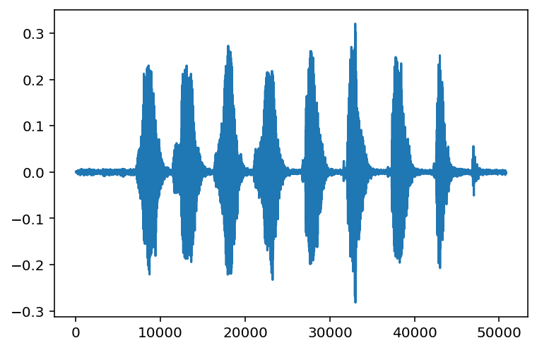

## Load packages

``` python
import torch
import torchaudio
import matplotlib.pyplot as plt
```

## Download and unzip data

PyTorch comes with many classic datasets.


Examples:


-   *[here](https://pytorch.org/vision/stable/datasets.html) is the list of available datasets for vision,*
-   *[here](https://pytorch.org/audio/stable/datasets.html?highlight=dataset#module-torchaudio.datasets) is the list for audio,*
-   *[here](https://pytorch.org/text/stable/datasets.html?highlight=dataset) is the list for texts.*
    

This is convenient to develop and test your model, or to compare its performance with existing models using these datasets.

Here, we will use [the YESNO dataset](https://www.openslr.org/1/) which can be accessed through [the torchaudio.datasets.YESNO class](https://pytorch.org/audio/stable/datasets.html#torchaudio.datasets.YESNO):

``` python
help(torchaudio.datasets.YESNO)
```

    Help on class YESNO in module torchaudio.datasets.yesno:

    class YESNO(torch.utils.data.dataset.Dataset)

     |  YESNO(root: Union[str, pathlib.Path], url: str = 'http://www.openslr.org/resources/1/waves_yesno.tar.gz', folder_in_archive: str = 'waves_yesno', download: bool = False) -> None
     |  
     |  Args:
     |      root (str or Path): Path to the directory where the dataset is found or downloaded.
     |      url (str, optional): The URL to download the dataset from.
     |          (default: "http://www.openslr.org/resources/1/waves_yesno.tar.gz")
     |      folder_in_archive (str, optional):
     |          The top-level directory of the dataset. (default: "waves_yesno")
     |      download (bool, optional):
     |          Whether to download the dataset if it is not found at root path. (default: False).



The `root` argument sets the location of the downloaded data.



<span style="font-size: 2rem;">**Where should I download data in a cluster?**</span>

We will all use the same data. It would make little sense to all download it in our home directory.

In the Alliance clusters, a good place to store data shared amongst members of a project is in the `/project` file system.

You usually belong to `/project/def-group;`, where `group` is the name of your PI. In our training cluster, we are all part of the group `def-sponsor00`, accessible through `/project/def-sponsor00`.



We will thus use `/project/def-sponsor00/data/` as the `root` argument for `torchaudio.datasets.yesno`):

``` python
yesno_data = torchaudio.datasets.YESNO(root='/project/def-sponsor00/data/', download=True)
```

## Explore the data

A data point in YESNO is a tuple of `waveform`, `sample_rate`, and `labels` (the labels are `1` for "yes" and `0` for "no").

Let's have a look at the first data point:

``` python
yesno_data[0]
```

    (tensor([[ 3.0518e-05,  6.1035e-05,  3.0518e-05,  ..., -1.8616e-03,
              -2.2583e-03, -1.3733e-03]]),
     8000,
     [0, 0, 0, 0, 1, 1, 1, 1])

Or, more nicely:

``` python
waveform, sample_rate, labels = yesno_data[0]
print("Waveform: {}\nSample rate: {}\nLabels: {}".format(waveform, sample_rate, labels))
```

    Waveform: tensor([[ 3.0518e-05,  6.1035e-05,  3.0518e-05,  ..., -1.8616e-03,
             -2.2583e-03, -1.3733e-03]])
    Sample rate: 8000
    Labels: [0, 0, 0, 0, 1, 1, 1, 1]

You can also plot the data. For this, we will use `pyplot` from `matplotlib`.

Let's look at the waveform:

``` python
plt.figure()
plt.plot(waveform.t().numpy())
```



## Split the data into a training set and a testing set

``` python
train_size = int(0.8 * len(yesno_data))
test_size = len(yesno_data) - train_size
train_dataset, test_dataset = torch.utils.data.random_split(yesno_data, [train_size, test_size])
```

## Create training and testing DataLoaders

DataLoaders are Python iterables created by the [torch.utils.data.DataLoader class](https://pytorch.org/docs/stable/data.html#torch.utils.data.DataLoader) from a dataset and a sampler.

We already have a dataset (`yesno_data`). Now we need a sampler (or sampling strategy) to draw samples from it. The sampling strategy contains the batch size, whether the data get shuffled prior to sampling, the number of workers used if the data is loaded in parallel, etc.

To create a training DataLoader with shuffled data and batch size of 1 (the default), we run:

``` python
train_loader = torch.utils.data.DataLoader(train_dataset, shuffle=True)
```

`data_loader` is an iterable of 0.8\*60=48 elements (80% of the 60 samples in the YESNO dataset):

``` python
len(train_loader)
```

    48

We do the same to create the testing DataLoader:

``` python
test_loader = torch.utils.data.DataLoader(test_dataset, shuffle=True)
```

## Why do we need to create a DataLoader?

A DataLoader is the iterable that "presents" data to a model. When we train a model, we run it for each element of the DataLoader in a for loop:

``` python
for i in data_loader:
    <run some model>
```

## Comments & questions
