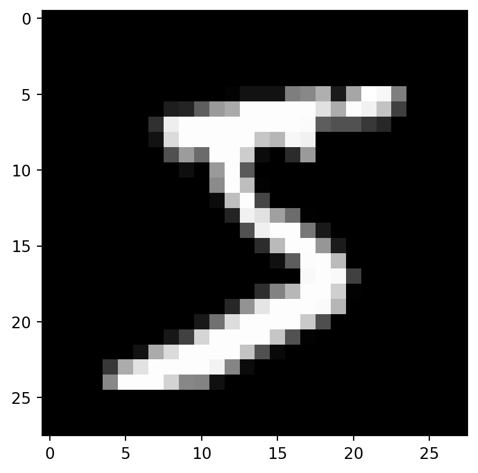
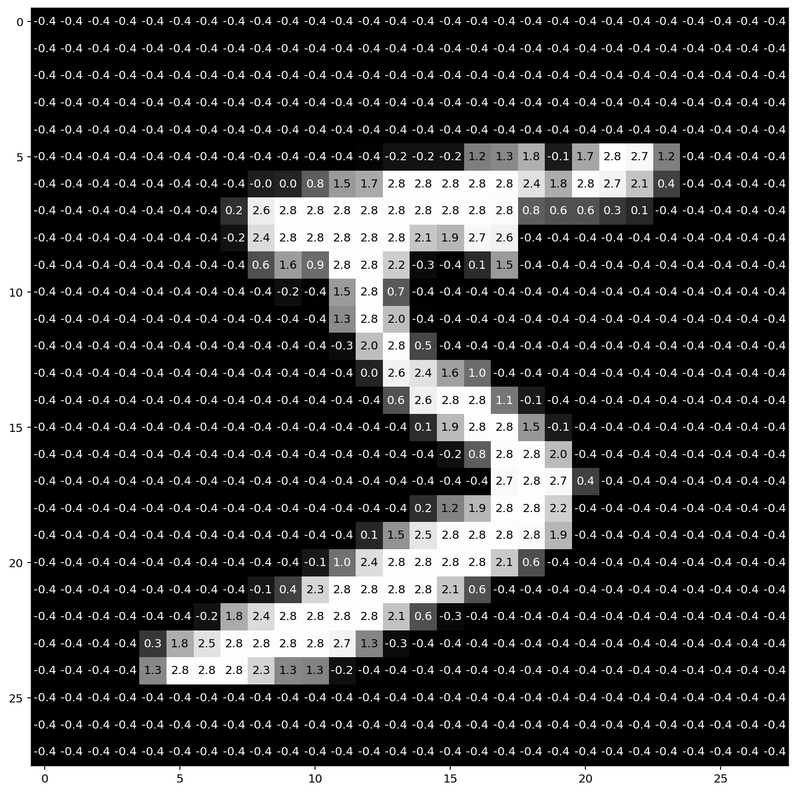

## Load packages

``` python
import torch
import torchvision
import torchvision.transforms as transforms
from torchvision import datasets
import matplotlib.pyplot as plt
```

## The MNIST dataset

The MNIST is possibly the most classic dataset used for testing machine learning systems. It consists of pairs of images of handwritten digits and their corresponding labels.

The images are composed of 28x28 pixels of greyscale RGB codes ranging from 0 to 255 and the labels are the digits from 0 to 9 that each image represents.

There are 60,000 training pairs and 10,000 testing pairs.

The goal is to build a neural network which can learn from the training set to properly identify the handwritten digits and which will perform well when presented with the testing set that it has never seen. This is a typical case of [supervised learning](https://en.wikipedia.org/wiki/Supervised_learning).




## Download, unzip, and transform data

The dataset can be downloaded from [the MNIST website](http://yann.lecun.com/exdb/mnist/), but it can also be downloaded directly from PyTorch.

``` python
help(torchvision.datasets.MNIST)
```

    Help on class MNIST in module torchvision.datasets.mnist:

    class MNIST(torchvision.datasets.vision.VisionDataset)

     |  MNIST(root: str, train: bool = True, transform: Optional[Callable] = None, target_transform: Optional[Callable] = None, download: bool = False) -> None
     |
     |  Args:
     |      root (string): Root directory of dataset where MNIST/raw/train-images-idx3-ubyte
     |          and  MNIST/raw/t10k-images-idx3-ubyte exist.
     |      train (bool, optional): If True, creates dataset from train-images-idx3-ubyte,
     |          otherwise from t10k-images-idx3-ubyte.
     |      download (bool, optional): If True, downloads the dataset from the internet and
     |          puts it in root directory. If dataset is already downloaded, it is not
     |          downloaded again.
     |      transform (callable, optional): A function/transform that  takes in an PIL image
     |          and returns a transformed version. E.g, transforms.RandomCrop
     |      target_transform (callable, optional): A function/transform that takes in the
     |          target and transforms it.



Note that here too, the `root` argument sets the location of the downloaded data and we will use `~/projects/def-sponsor00/data/`.

The MNIST dataset already consists of a training and a testing sets, so we don't have to split the data manually. Instead, we can directly create 2 different objects with the same function (`train=True` selects the train set and `train=False` selects the test set).

Another difference compared to the previous example is that we will transform the raw data to tensors and normalize them using the mean and standard deviation of the MNIST training set (0.1307 and 0.3081 respectively). (Even though the mean and standard deviation of the test data are slightly different, it is important to normalize the test data in the same way.) So we first need to define a transformation:

``` python
transform = transforms.Compose([
    transforms.ToTensor(),
    transforms.Normalize((0.1307,), (0.3081,))
])
```

We can now create our data objects:

``` python
train_data = datasets.MNIST(
    '~/projects/def-sponsor00/data/',
    train=True, download=True, transform=transform)

test_data = datasets.MNIST(
    '~/projects/def-sponsor00/data/',
    train=False, transform=transform)
```

## Explore the data

``` python
print(len(train_data))
```

    60000

That makes sense since the MNIST's training set has 60,000 pairs. `train_data` has 60,000 elements and we should expect each element to be of size 2 since it is a pair. Let's double-check with the first element:

``` python
print(len(train_data[0]))
```

    2

We can print that first pair:

``` python
print(train_data[0])
```

    (tensor([[[-0.4242, -0.4242, -0.4242, -0.4242, -0.4242, -0.4242, -0.4242,
              -0.4242, -0.4242, -0.4242, -0.4242, -0.4242, -0.4242, -0.4242,
              -0.4242, -0.4242, -0.4242, -0.4242, -0.4242, -0.4242, -0.4242,
              -0.4242, -0.4242, -0.4242, -0.4242, -0.4242, -0.4242, -0.4242],
             [-0.4242, -0.4242, -0.4242, -0.4242, -0.4242, -0.4242, -0.4242,
              -0.4242, -0.4242, -0.4242, -0.4242, -0.4242, -0.4242, -0.4242,
              -0.4242, -0.4242, -0.4242, -0.4242, -0.4242, -0.4242, -0.4242,
              -0.4242, -0.4242, -0.4242, -0.4242, -0.4242, -0.4242, -0.4242],
             [-0.4242, -0.4242, -0.4242, -0.4242, -0.4242, -0.4242, -0.4242,
              -0.4242, -0.4242, -0.4242, -0.4242, -0.4242, -0.4242, -0.4242,
              -0.4242, -0.4242, -0.4242, -0.4242, -0.4242, -0.4242, -0.4242,
              -0.4242, -0.4242, -0.4242, -0.4242, -0.4242, -0.4242, -0.4242],
             [-0.4242, -0.4242, -0.4242, -0.4242, -0.4242, -0.4242, -0.4242,
              -0.4242, -0.4242, -0.4242, -0.4242, -0.4242, -0.4242, -0.4242,
              -0.4242, -0.4242, -0.4242, -0.4242, -0.4242, -0.4242, -0.4242,
              -0.4242, -0.4242, -0.4242, -0.4242, -0.4242, -0.4242, -0.4242],
             [-0.4242, -0.4242, -0.4242, -0.4242, -0.4242, -0.4242, -0.4242,
              -0.4242, -0.4242, -0.4242, -0.4242, -0.4242, -0.4242, -0.4242,
              -0.4242, -0.4242, -0.4242, -0.4242, -0.4242, -0.4242, -0.4242,
              -0.4242, -0.4242, -0.4242, -0.4242, -0.4242, -0.4242, -0.4242],
             [-0.4242, -0.4242, -0.4242, -0.4242, -0.4242, -0.4242, -0.4242,
              -0.4242, -0.4242, -0.4242, -0.4242, -0.4242, -0.3860, -0.1951,
              -0.1951, -0.1951,  1.1795,  1.3068,  1.8032, -0.0933,  1.6887,
               2.8215,  2.7197,  1.1923, -0.4242, -0.4242, -0.4242, -0.4242],
             [-0.4242, -0.4242, -0.4242, -0.4242, -0.4242, -0.4242, -0.4242,
              -0.4242, -0.0424,  0.0340,  0.7722,  1.5359,  1.7396,  2.7960,
               2.7960,  2.7960,  2.7960,  2.7960,  2.4396,  1.7650,  2.7960,
               2.6560,  2.0578,  0.3904, -0.4242, -0.4242, -0.4242, -0.4242],
             [-0.4242, -0.4242, -0.4242, -0.4242, -0.4242, -0.4242, -0.4242,
               0.1995,  2.6051,  2.7960,  2.7960,  2.7960,  2.7960,  2.7960,
               2.7960,  2.7960,  2.7960,  2.7706,  0.7595,  0.6195,  0.6195,
               0.2886,  0.0722, -0.4242, -0.4242, -0.4242, -0.4242, -0.4242],
             [-0.4242, -0.4242, -0.4242, -0.4242, -0.4242, -0.4242, -0.4242,
              -0.1951,  2.3633,  2.7960,  2.7960,  2.7960,  2.7960,  2.7960,
               2.0960,  1.8923,  2.7197,  2.6433, -0.4242, -0.4242, -0.4242,
              -0.4242, -0.4242, -0.4242, -0.4242, -0.4242, -0.4242, -0.4242],
             [-0.4242, -0.4242, -0.4242, -0.4242, -0.4242, -0.4242, -0.4242,
              -0.4242,  0.5940,  1.5614,  0.9377,  2.7960,  2.7960,  2.1851,
              -0.2842, -0.4242,  0.1231,  1.5359, -0.4242, -0.4242, -0.4242,
              -0.4242, -0.4242, -0.4242, -0.4242, -0.4242, -0.4242, -0.4242],
             [-0.4242, -0.4242, -0.4242, -0.4242, -0.4242, -0.4242, -0.4242,
              -0.4242, -0.4242, -0.2460, -0.4115,  1.5359,  2.7960,  0.7213,
              -0.4242, -0.4242, -0.4242, -0.4242, -0.4242, -0.4242, -0.4242,
              -0.4242, -0.4242, -0.4242, -0.4242, -0.4242, -0.4242, -0.4242],
             [-0.4242, -0.4242, -0.4242, -0.4242, -0.4242, -0.4242, -0.4242,
              -0.4242, -0.4242, -0.4242, -0.4242,  1.3450,  2.7960,  1.9942,
              -0.3988, -0.4242, -0.4242, -0.4242, -0.4242, -0.4242, -0.4242,
              -0.4242, -0.4242, -0.4242, -0.4242, -0.4242, -0.4242, -0.4242],
             [-0.4242, -0.4242, -0.4242, -0.4242, -0.4242, -0.4242, -0.4242,
              -0.4242, -0.4242, -0.4242, -0.4242, -0.2842,  1.9942,  2.7960,
               0.4668, -0.4242, -0.4242, -0.4242, -0.4242, -0.4242, -0.4242,
              -0.4242, -0.4242, -0.4242, -0.4242, -0.4242, -0.4242, -0.4242],
             [-0.4242, -0.4242, -0.4242, -0.4242, -0.4242, -0.4242, -0.4242,
              -0.4242, -0.4242, -0.4242, -0.4242, -0.4242,  0.0213,  2.6433,
               2.4396,  1.6123,  0.9504, -0.4115, -0.4242, -0.4242, -0.4242,
              -0.4242, -0.4242, -0.4242, -0.4242, -0.4242, -0.4242, -0.4242],
             [-0.4242, -0.4242, -0.4242, -0.4242, -0.4242, -0.4242, -0.4242,
              -0.4242, -0.4242, -0.4242, -0.4242, -0.4242, -0.4242,  0.6068,
               2.6306,  2.7960,  2.7960,  1.0904, -0.1060, -0.4242, -0.4242,
              -0.4242, -0.4242, -0.4242, -0.4242, -0.4242, -0.4242, -0.4242],
             [-0.4242, -0.4242, -0.4242, -0.4242, -0.4242, -0.4242, -0.4242,
              -0.4242, -0.4242, -0.4242, -0.4242, -0.4242, -0.4242, -0.4242,
               0.1486,  1.9432,  2.7960,  2.7960,  1.4850, -0.0806, -0.4242,
              -0.4242, -0.4242, -0.4242, -0.4242, -0.4242, -0.4242, -0.4242],
             [-0.4242, -0.4242, -0.4242, -0.4242, -0.4242, -0.4242, -0.4242,
              -0.4242, -0.4242, -0.4242, -0.4242, -0.4242, -0.4242, -0.4242,
              -0.4242, -0.2206,  0.7595,  2.7833,  2.7960,  1.9560, -0.4242,
              -0.4242, -0.4242, -0.4242, -0.4242, -0.4242, -0.4242, -0.4242],
             [-0.4242, -0.4242, -0.4242, -0.4242, -0.4242, -0.4242, -0.4242,
              -0.4242, -0.4242, -0.4242, -0.4242, -0.4242, -0.4242, -0.4242,
              -0.4242, -0.4242, -0.4242,  2.7451,  2.7960,  2.7451,  0.3904,
              -0.4242, -0.4242, -0.4242, -0.4242, -0.4242, -0.4242, -0.4242],
             [-0.4242, -0.4242, -0.4242, -0.4242, -0.4242, -0.4242, -0.4242,
              -0.4242, -0.4242, -0.4242, -0.4242, -0.4242, -0.4242, -0.4242,
               0.1613,  1.2305,  1.9051,  2.7960,  2.7960,  2.2105, -0.3988,
              -0.4242, -0.4242, -0.4242, -0.4242, -0.4242, -0.4242, -0.4242],
             [-0.4242, -0.4242, -0.4242, -0.4242, -0.4242, -0.4242, -0.4242,
              -0.4242, -0.4242, -0.4242, -0.4242, -0.4242,  0.0722,  1.4596,
               2.4906,  2.7960,  2.7960,  2.7960,  2.7578,  1.8923, -0.4242,
              -0.4242, -0.4242, -0.4242, -0.4242, -0.4242, -0.4242, -0.4242],
             [-0.4242, -0.4242, -0.4242, -0.4242, -0.4242, -0.4242, -0.4242,
              -0.4242, -0.4242, -0.4242, -0.1187,  1.0268,  2.3887,  2.7960,
               2.7960,  2.7960,  2.7960,  2.1342,  0.5686, -0.4242, -0.4242,
              -0.4242, -0.4242, -0.4242, -0.4242, -0.4242, -0.4242, -0.4242],
             [-0.4242, -0.4242, -0.4242, -0.4242, -0.4242, -0.4242, -0.4242,
              -0.4242, -0.1315,  0.4159,  2.2869,  2.7960,  2.7960,  2.7960,
               2.7960,  2.0960,  0.6068, -0.3988, -0.4242, -0.4242, -0.4242,
              -0.4242, -0.4242, -0.4242, -0.4242, -0.4242, -0.4242, -0.4242],
             [-0.4242, -0.4242, -0.4242, -0.4242, -0.4242, -0.4242, -0.1951,
               1.7523,  2.3633,  2.7960,  2.7960,  2.7960,  2.7960,  2.0578,
               0.5940, -0.3097, -0.4242, -0.4242, -0.4242, -0.4242, -0.4242,
              -0.4242, -0.4242, -0.4242, -0.4242, -0.4242, -0.4242, -0.4242],
             [-0.4242, -0.4242, -0.4242, -0.4242,  0.2758,  1.7650,  2.4524,
               2.7960,  2.7960,  2.7960,  2.7960,  2.6815,  1.2686, -0.2842,
              -0.4242, -0.4242, -0.4242, -0.4242, -0.4242, -0.4242, -0.4242,
              -0.4242, -0.4242, -0.4242, -0.4242, -0.4242, -0.4242, -0.4242],
             [-0.4242, -0.4242, -0.4242, -0.4242,  1.3068,  2.7960,  2.7960,
               2.7960,  2.2742,  1.2941,  1.2559, -0.2206, -0.4242, -0.4242,
              -0.4242, -0.4242, -0.4242, -0.4242, -0.4242, -0.4242, -0.4242,
              -0.4242, -0.4242, -0.4242, -0.4242, -0.4242, -0.4242, -0.4242],
             [-0.4242, -0.4242, -0.4242, -0.4242, -0.4242, -0.4242, -0.4242,
              -0.4242, -0.4242, -0.4242, -0.4242, -0.4242, -0.4242, -0.4242,
              -0.4242, -0.4242, -0.4242, -0.4242, -0.4242, -0.4242, -0.4242,
              -0.4242, -0.4242, -0.4242, -0.4242, -0.4242, -0.4242, -0.4242],
             [-0.4242, -0.4242, -0.4242, -0.4242, -0.4242, -0.4242, -0.4242,
              -0.4242, -0.4242, -0.4242, -0.4242, -0.4242, -0.4242, -0.4242,
              -0.4242, -0.4242, -0.4242, -0.4242, -0.4242, -0.4242, -0.4242,
              -0.4242, -0.4242, -0.4242, -0.4242, -0.4242, -0.4242, -0.4242],
             [-0.4242, -0.4242, -0.4242, -0.4242, -0.4242, -0.4242, -0.4242,
              -0.4242, -0.4242, -0.4242, -0.4242, -0.4242, -0.4242, -0.4242,
              -0.4242, -0.4242, -0.4242, -0.4242, -0.4242, -0.4242, -0.4242,
              -0.4242, -0.4242, -0.4242, -0.4242, -0.4242, -0.4242, -0.4242]]]), 5)

And you can see that it is a tuple with:

``` python
print(type(train_data[0]))
```

    <class 'tuple'>

What is that tuple made of?

``` python
print(type(train_data[0][0]))
print(type(train_data[0][1]))
```

    <class 'torch.Tensor'>
    <class 'int'>

It is made of the tensor for the first image (remember that we transformed the images into tensors when we created the objects `train_data` and `test_data`) and the integer of the first label (which you can see is 5 when you print `train_data[0][1]`).

So since `train_data[0][0]` is the tensor representing the image of the first pair, let's check its size:

``` python
print(train_data[0][0].size())
```

    torch.Size([1, 28, 28])

That makes sense: a color image would have 3 layers of RGB values (so the size in the first dimension would be 3), but because the MNIST has black and white images, there is a single layer of values---the values of each pixel on a gray scale---so the first dimension has a size of 1. The 2nd and 3rd dimensions correspond to the width and length of the image in pixels, hence 28 and 28.

### Plotting an image from the data

First, we select the image of the first pair and we resize it from 3 to 2 dimensions by removing its dimension of size 1 with `torch.squeeze`:

``` python
img = torch.squeeze(train_data[0][0])
```

Then, we plot it with `pyplot`:, but since we are in a cluster, instead of showing it to screen with `plt.show()`, we save it to file:

``` python
plt.imshow(img, cmap='gray')
```

    <matplotlib.image.AxesImage at 0x7f8648633250>



And indeed, it matches the first label we explored earlier (`train_data[0][1]`).

### Plotting an image with its pixel values

We can plot it with more details by showing the value of each pixel in the image. One little twist is that we need to pick a threshold value below which we print the pixel values in white otherwise they would not be visible (black on near black background). We also round the pixel values to one decimal digit so as not to clutter the result.

``` python
imgplot = plt.figure(figsize = (12, 12))
sub = imgplot.add_subplot(111)
sub.imshow(img, cmap='gray')
width, height = img.shape
thresh = img.max() / 2.5
for x in range(width):
    for y in range(height):
        val = round(img[x][y].item(), 1)
        sub.annotate(str(val), xy=(y, x),
                     horizontalalignment='center',
                     verticalalignment='center',
                     color='white' if img[x][y].item() < thresh else 'black')
```



## Create the DataLoaders

Training data:

``` python
train_loader = torch.utils.data.DataLoader(
    train_data, batch_size=20, shuffle=True)
```

Test data:

``` python
test_loader = torch.utils.data.DataLoader(
    test_data, batch_size=20, shuffle=False)
```

## Plot a full batch of images with their labels

Now that we have a training DataLoader, it is easy to select a batch from it. Let's plot an entire batch of images with their labels.

First, we need to get one batch of training images and their labels:

``` python
dataiter = iter(train_loader)
batchimg, batchlabel = dataiter.next()
```

Then, we can plot them:

``` python
batchplot = plt.figure(figsize=(20, 5))
for i in torch.arange(20):
    sub = batchplot.add_subplot(2, 10, i+1, xticks=[], yticks=[])
    sub.imshow(torch.squeeze(batchimg[i]), cmap='gray')
    sub.set_title(str(batchlabel[i].item()), fontsize=25)
```

{{}}


## Comments & questions
